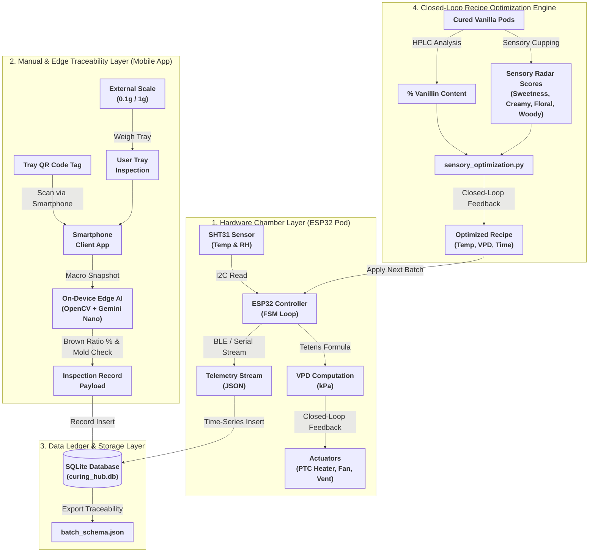
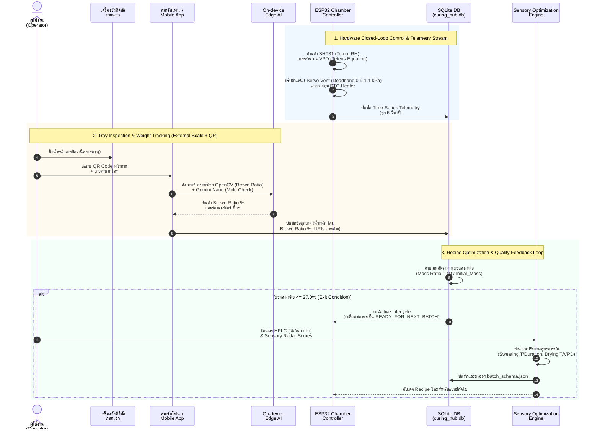

# แผนภาพสถาปัตยกรรมข้อมูลและการไหลของระบบ (End-to-End Data Pipeline & Architecture Flow)
## ตู้บ่มวานิลลาอัตโนมัติ (Automated Vanilla Curing Hub - 5kg Prototype)

เอกสารฉบับนี้อธิบายทิศทางการไหลของข้อมูล (Data Flow) และการแปลงสภาพข้อมูล (Data Transformation) ตั้งแต่ระดับเซนเซอร์ภายในตู้บ่ม การติดตามถาดด้วย QR Code และเครื่องชั่งดิจิทัลภายนอก ฐานข้อมูลคลังจัดเก็บ (Database Ledger) จนถึงเอนจินปรับแต่งสูตรการบ่มแบบ Closed-Loop (Sensory Optimization Engine)

---

## 1. ผังการไหลของข้อมูลภาพรวมระบบ (End-to-End System Architecture Flowchart)

---

## 2. ลำดับการทำงานของข้อมูลแบบละเอียดยิบ (End-to-End Sequence Diagram)

---

## 3. รายละเอียดการแปลงสภาพข้อมูลในแต่ละลำดับชั้น (Data Transformation Pipeline Details)

### 3.1 Hardware Layer (In-Chamber Telemetry Transformation)
- **การป้อนเข้า (Input):** ค่าอนาล็อก/ดิจิทัลจากเซนเซอร์ SHT31 (อุณหภูมิ $T_{\text{air}}$ และ ความชื้นสัมพัทธ์ $\text{RH}_{\text{air}}$) ผ่าน I2C
- **สมการประมวลผล (Transformation):** สมการ Tetens Equation คำนวณค่าความดันไอน้ำส่วนขาด (VPD):
  $$\text{VPD} = 0.61078 \times \exp\left(\frac{17.27 \times T_{\text{air}}}{T_{\text{air}} + 237.3}\right) \times \left(1 - \frac{\text{RH}_{\text{air}}}{100}\right) \quad [\text{kPa}]$$
- **ผลลัพธ์ (Output):** คำสั่งปรับระดับองศา Servo Vent ($\pm 10\%$) ตามช่วง Hysteresis Deadband $[0.9, 1.1]\text{ kPa}$ และ JSON Telemetry Stream ออกทาง BLE/Serial

### 3.2 Manual & Edge Traceability Layer (Tray Tracking via QR)
- **การป้อนเข้า (Input):** ภาพถ่ายมาโครประจำถาด + ค่าน้ำหนักถาดสดจากเครื่องชั่งดิจิทัลภายนอก + รหัส QR Code ประจำถาด
- **สมการประมวลผล (Transformation):**
  - OpenCV HSV Color Segmentation หาค่า `brown_ratio` (%)
  - Gemini Nano Edge AI ตรวจสอบ `mold_detected` (Boolean)
  - คำนวณเปอร์เซ็นต์มวลคงเหลือ: $\text{Mass Ratio (\%)} = \left(\frac{M_{\text{current}}}{M_{\text{initial}}}\right) \times 100$
- **ผลลัพธ์ (Output):** โครงสร้างข้อมูล `InspectionPayload` บันทึกลงตาราง `vision_inspections` และ `sensor_telemetry`

### 3.3 Data Ledger & Storage Layer
- **การป้อนเข้า (Input):** ข้อมูลเซนเซอร์เรียลไทม์ และข้อมูลสแกนถาดรายวัน
- **สมการประมวลผล (Transformation):** จัดรูปแบบเป็น Schema มาตรฐานตาม [batch_schema.json](file:///g:/My%20Drive/06.%20vanilla-curing-hub/batch_schema.json)
- **ผลลัพธ์ (Output):** ฐานข้อมูล SQLite [curing_hub.db](file:///g:/My%20Drive/06.%20vanilla-curing-hub/curing_hub.db) (WAL Mode) และไฟล์ส่งออก JSON

### 3.4 Closed-Loop Optimization Engine
- **การป้อนเข้า (Input):** ผลตรวจทางแล็บ HPLC (% Vanillin) และผลทดลองชิม Sensory Cupping Radar Score (`sweetness`, `creamy`, `floral`, `woody`, `defect_off_flavor`)
- **สมการประมวลผล (Transformation):** ฟังก์ชัน `compute_optimized_recipe()` ใน [sensory_optimization.py](file:///g:/My%20Drive/06.%20vanilla-curing-hub/sensory_optimization.py) คำนวณปรับแต่งอุณหภูมิ ระยะเวลาบ่ม และเป้าหมาย VPD
- **ผลลัพธ์ (Output):** ค่า Recipe Parameters ใหม่ที่ได้รับการ Optimize เพื่อส่งต่อให้ ESP32 Controller ใช้ในการบ่มแบทช์ถัดไป
